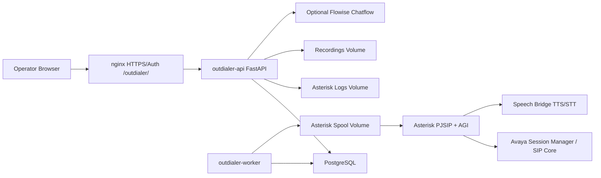
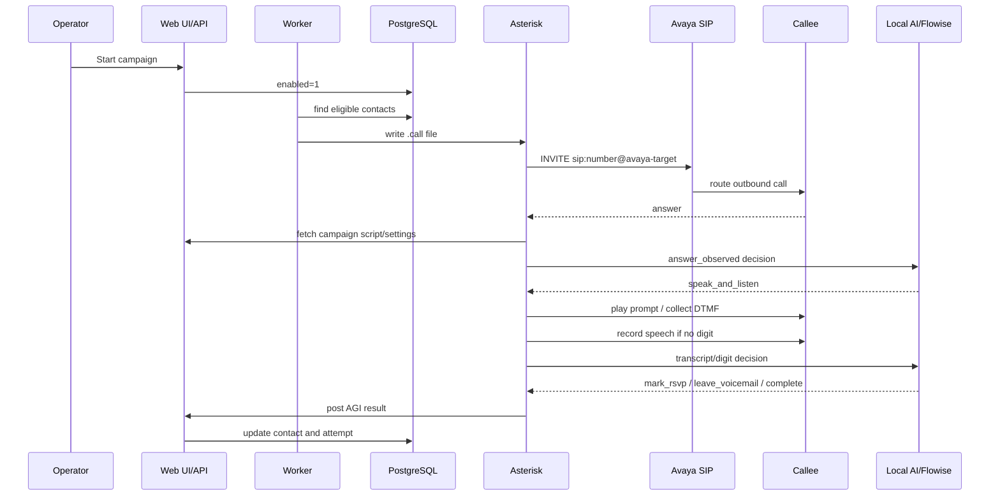

# Outdialer Project Guide

Version: v0.1.0

## Purpose

Outdialer Project is a Dockerized SIP outdialer built for small RSVP-style campaigns. It was designed around a family birthday-party verification workflow, but the code is generic enough for other consented calling lists.

The system places outbound calls through an Avaya SIP environment, plays a configurable script, collects DTMF and spoken responses, updates contact status, and exposes call activity through a web UI.

## What It Includes

- FastAPI web UI and JSON API.
- PostgreSQL campaign/contact/call-attempt storage.
- Worker process that schedules eligible contacts and writes Asterisk call files.
- Asterisk PJSIP container for SIP signaling, RTP media, AGI call flow, DTMF collection, TTS, and speech capture.
- Asterisk SIP trace viewer, diagnostics viewer, call log viewer, CSV exports, and contact editor.
- Local AI fallback for RSVP decisions.
- Optional Flowise integration for AI call-flow decisions.
- Optional speech bridge integration for TTS/STT.

## Architecture



## Service Responsibilities

### outdialer-api

The API service renders the web UI and exposes endpoints for contacts, campaigns, settings, scripts, logs, SIP traces, AI decisions, and AGI results. It reads Asterisk logs and recordings through read-only mounted volumes.

### outdialer-worker

The worker wakes every `WORKER_TICK_SECONDS`, finds enabled campaigns, checks local call windows, selects pending/no-response contacts that are eligible, writes call metadata into the database, and creates Asterisk `.call` files.

### asterisk

Asterisk handles SIP signaling and media. It loads PJSIP configuration from environment templates, enables PJSIP logging, watches the outgoing spool, originates calls to Avaya, answers bridged channels, and runs `rsvp_agi.py`.

### postgres

PostgreSQL stores campaigns, contacts, call attempts, diagnostic events, and older compatibility settings.

### redis

Redis is included as a reserved service for future queue/pacing work. The current worker does not require Redis for core dialing.

## Call Flow



## Fast-Start Audio

The current recommended call behavior is fast-start:

```text
AI_GREETING_RECORD_MS=0
```

With this setting, Asterisk does not record and transcribe before first speech. The call flow answers, waits briefly for media cut-through, then speaks immediately. This avoids the long silence caused by pre-greeting STT and AI decisions.

The active dialplan waits only `0.2` seconds after answer:

```asterisk
same => n,Answer()
same => n,Wait(0.2)
same => n,AGI(rsvp_agi.py)
```

If you need stronger voicemail detection before the first prompt, set `AI_GREETING_RECORD_MS` or the campaign's Observe Milliseconds above zero. This trades speed for more pre-prompt classification.

## Number Formatting

Each campaign controls:

- Number format:
  - `nanp_1`: strip punctuation and add `1` to 10-digit North American numbers.
  - `strip_only`: strip punctuation without adding `1`.
  - `as_entered`: keep `+`, `*`, and `#`.
- Dial prefix:
  - prepended after number-format processing, for example `9` or `91`.

The dialed number is logged on each attempt so routing decisions can be audited.

## Caller ID And SIP Identity

Campaign settings control `Caller ID Name` and `Caller ID Number`.

The worker sets:

- Asterisk `CallerID`.
- `CALLERID(name)`.
- `CALLERID(num)`.
- `P-Asserted-Identity`.
- `P-Preferred-Identity`.

The PJSIP endpoint is configured with:

```text
send_pai=yes
send_rpid=yes
trust_id_outbound=yes
```

Avaya must still allow the chosen caller ID. If Avaya rejects or rewrites caller ID, inspect Session Manager routing/adaptation, Communication Manager trunk settings, and SIP trace output.

## SIP Routing Summary

The worker builds the SIP channel as:

```text
PJSIP/avaya/sip:DIALED_NUMBER@AVAYA_SIP_CONTACT_HOST:5060
```

Important fields:

- SIP Request-URI/To target: `sip:DIALED_NUMBER@AVAYA_SIP_CONTACT_HOST`
- From identity: `sip:CALLER_ID_NUMBER@AVAYA_FROM_DOMAIN`
- Route/proxy: `AVAYA_OUTBOUND_PROXY` when configured, otherwise the Avaya contact host.

For Avaya Session Manager, the Request-URI host should be the Session Manager/SM100 SIP listener, not a domain controller or non-SIP host.

## Web UI Tabs

- Dashboard: campaign state, readiness, recent calls, recent diagnostics.
- Contacts: CSV/imported list, inline edit, reset, delete, auto-refresh.
- Call Log: attempt history, SIP metadata, transcript, AI decision, recording, export.
- Asterisk SIP Trace: Asterisk-side SIP messages, filter/sort/limit/export/clear view.
- Diagnostics: application and worker events.
- Settings: caller ID, dialing, call window, retry limits, pacing.
- AI Flow: local/Flowise provider settings, timing, prompts, builder notes.
- Voice Script: prompt text for intro, voicemail, voice prompt, thank-you, no-response.
- Campaigns: create/open separate campaigns.

## Deployment

1. Copy `.env.example` to `.env`.
2. Fill in Avaya, caller ID, database, and speech/AI settings.
3. Start services:

```bash
docker compose up -d --build
```

4. Check health:

```bash
curl http://localhost:8088/health
```

5. Put nginx/HTTPS/auth in front of the UI for production access.

## Docker Images

Published image names:

```text
dblagbro/outdialer-project-app:latest
dblagbro/outdialer-project-asterisk:latest
```

The same app image is used for `outdialer-api` and `outdialer-worker`; behavior is selected by `APP_ROLE`.

## Backup Summary

Minimum backup set:

- PostgreSQL dump.
- `.env` stored securely outside Git.
- Any customized nginx config.
- Optional recordings/log exports if operationally needed.

Do not include `.env`, recordings, logs, or database dumps in public GitHub releases.

## Troubleshooting Summary

- No calls being queued: check campaign enabled, call window, contact status, attempts, retry time, worker logs.
- INVITE does not reach Avaya: check `AVAYA_SIP_HOST`, `AVAYA_SIP_CONTACT_HOST`, route/proxy, firewall, Asterisk PJSIP trace.
- Avaya routes to wrong host: verify Request-URI host and Avaya routing policy; domain controllers are not SIP targets.
- 403 invalid From domain: fix `AVAYA_FROM_DOMAIN` and Avaya allowed domain/adaptation.
- 404 no route available: fix Avaya routing/dial pattern or dial prefix/normalization.
- Slow first audio: keep Observe Milliseconds at `0`, verify TTS cache, lower `TTS_TIMEOUT_SECONDS`, and confirm RTP path.
- No audio: inspect RTP ports, NAT/external media settings, firewall, codec, and Avaya media path.

## Safe Operating Rules

- Call only people who expect or consent to the calls.
- Use recognizable caller ID.
- Keep call windows reasonable.
- Use low retry limits.
- Offer a callback path.
- Keep logs and recordings private.
